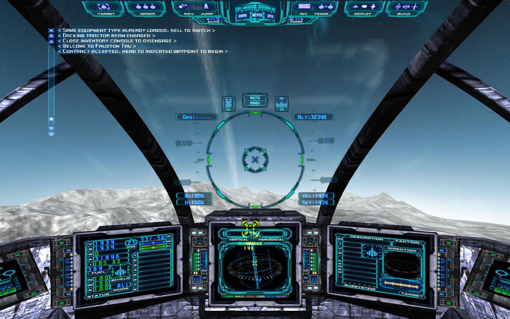

# SciFi UI Project

Name: Ben Cox

Student Number: C17325641

# Description of the assignment

The task for this assignment was to create a SciFi User Interface similar to what is found in movies and other media.

This assignment is written in Java code and uses processing libraries to enable visualizations. 

The design of my assignment is based off of the a Scifi UI found while researching for this project:



While the final project is vastly different, it was from this image that I started the design process. I incorporated the multiscreen layout and used a similar targetting system.

# Instructions
While the purpose of the assignment was to create a SciFi UI, due to the interactive elements of this UI, it plays as a space shooter. Using the arrow keys to control the user's targeting and weapons system, you can travel between galaxies and destroy enemy ships and planets.

Each successive galaxy will have more enemies and planets to defeat. Rounds change automatically once all targets are destroyed.

Your ship offers three selectable weapons - lazers, missiles and sentry gun. Each weapon is powerful enough to destroy your target, but all have their own unique animation. These can be selected using the number keys.

Your turret has the ability to pan 360 degrees in the X-axis and 180 degrees in the Y-axis. This is to replicate the control of a top mounted turret on a spaceship.

The cursor controls an addition targeting option, but is only used for identifying plantes. Simply hover the cursor via a mouse or trackpad over any planet to find it's name. The names are sourced from the names of all know exoplanets and can be found here:
[Exoplanet Names](https://en.wikipedia.org/wiki/List_of_exoplanets_(full))
## User Controls:

| Control Turret | Toggle |
|-----------|-----------|
|Look Up | Up Arrow on Keyboard |
|Look Down | Down Arrow on Keyboard |
|Look Left | Left Arrow on Keyboard |
|Look Right | Right Arrow on Keyboard |

| Weapon | Toggle |
|-----------|-----------|
|Lazer | Number 1 on Keyboard |
|Missiles | Number 2 on Keyboard |
|Sentry Gun | Number 3 on Keyboard |

*To Fire Weapons: Space Bar*


# How it works
For this assignment, I used Java and processing libraries to create my SciFi user interface. Once launched, Main.java is used to call startUI which runs the sketch. The core elements of the sketch are in UI.java and additional classes were created as neccessary.

Libraries used:
-java.time is used for get the current time and displaying on a clock
-java.util is used for ArrayLists for storing planet names and scenary objects

Several classes were created for this project and can be summarized as follows:

| Class | Purpose |
|-----------|-----------|
|Dashboard | Used for drawing the dashboard on top and bottom of the screen |
|Interior | Used for drawing the interior window |
|Scene | An abstract class used for various scenary classes. It handles basic parameters and has update,render and minimap method |
|Planets | Extends the Scene class. This is used for drawing the generated planets each round and displays them on the minimap also. The update function is used for when the turret is rotating |
|Screens | Used for rendering the multiple screens in the cockpit and their bezels |
|Ships | Extends the Scene class. This is used for drawing the generated enemy ships each round and displays them on the minimap also. The update function is used for when the turret is rotating |
|Stars | Extends the Scene class. This is used for drawing the generated stars each round for scenary and displays them on the minimap also. The update function is used for when the turret is rotating |
|Target | Used for drawing the turrets large target, reticle and target/weapon information. The update method is used to check if a target is in range of the crosshairs |

UI.java has quite a lot of variables, some functional while others are used to reduce the amount of duplicate code and complicated fractions. For example, function variables such as level, compassX, compassY etc. are crucial to the program, whereas the multiple variables used for the screen dimensions are used reduce the amount of duplicate code when interacting with the screens be it for rendering them or the information on them. Variables are given intuitive names that describe their purpose where posssible.

There are 4 ArrayLists used in UI.java. 3 are of type Scene and store objects relevnt to the scenary such as planets, stars and enemies. The last ArrayList stores strings for the planet names. An ArrayList is beneficial for all of the use cases as their amounts vary each round i.e. more planets every round but less names remaining.

User input is also handled in the UI.java files via the keyPressed, keyReleased and checkKey methods for keyboard input. Possible inputs are numbers for selecting weapons, arrow keys for rotating, and the space bar for firing the selected weapon. The cursor and mouse clicks are also accommodated. The cursor can be used for highlighting a planet and have it's name displayed, while a mouse press will generate a random background color via the mouseClicked method. The cursor control is handled by using the dist method to compare the distance of mouseX and mouseY to the center of each planet. If the distance is less than the radius, then the planet's name will be displayed until the mouse moves or the planet is destroyed.

The setup method sets variables to their relative values based on the screen size and instatiates the needed objects. It also calls the loadName method which loads the planet names from a comma seperated value file called planets.csv. It reads each name and adds it to the planetNames ArrayList.

the planetName method draws a screen at the top of the screen and asks the user to use their cursor to indentify planets. Whenn the user hovers the cursor over a planet, it's name is displayed. This is handled by looping through all visible planets and comparing their distance from the current mouse position.

The draw method is called 60 times a second and as such, contains all neccessary method calls for drawing. Firstly it calls the createPlanets, createStars and createShips methods. These contain while loops which are used to create the needed objects each round and adding them to their respective ArrayLists. During each round, these loops do nothing, as the object don't need to be created until the next round. These objects are drawn using the drawStars, drawScene and drawShips methods. These loop through all the objects in their relevant ArrayList and update and render them as neccessary.

The blowup method handles the animation for explosions when planets or enemies are destroyed. It checks if the boolean explode is true. It will be true if in the previous draw call, a planet was shot at. If it's true, it will animate the explosion by drawing ellipses and making them bigger each draw until they're big enough. Once large enough, explode is set to false. If explode is false, explosionColor is set to the correct color depending on the current weapon system.

The drawCursor method simply draws a hollow rectange around the cursor to show the user where they're pointing currently. drawing the scenery and cursor, the inside of the ship is rendered. This is down using the relevant methods. interior.render for example renders the interior window, while dash.render renders the top and bottom dashboard. The various screen methods simply render the screens. The roundNum method is used for displaying the current round to the user and shows the weapons available.

The info method renders the relevant information onto the 3 screens. First, it converts the current X co-ordinate so that it's understandable i.e. makes sure it's between 0 and 360. On the left screen, the ships co-ordinates are displayed. Next, the middle screen's information is displayed. In this case, this means rendering the in game minimap displaying the stars, planets and enemies. This is done vie each objects minimap method achieved through the use of the abstract class Scene which ensures they all have the minimap method. A crosshair is then rendered on the minimpap to show the user's position. Finally, the right screen's information is rendered. This includes the number of planets and enemies remaining, which is found by checking the size of their respective ArrayLists.


# What I am most proud of in the assignment

# Markdown Tutorial

This is *emphasis*

This is a bulleted list

- Item
- Item

This is a numbered list

1. Item
1. Item

This is a [hyperlink](http://bryanduggan.org)

# Headings
## Headings
#### Headings
##### Headings

This is code:

```Java
public void render()
{
	ui.noFill();
	ui.stroke(255);
	ui.rect(x, y, width, height);
	ui.textAlign(PApplet.CENTER, PApplet.CENTER);
	ui.text(text, x + width * 0.5f, y + height * 0.5f);
}
```

So is this without specifying the language:

```
public void render()
{
	ui.noFill();
	ui.stroke(255);
	ui.rect(x, y, width, height);
	ui.textAlign(PApplet.CENTER, PApplet.CENTER);
	ui.text(text, x + width * 0.5f, y + height * 0.5f);
}
```

This is an image using a relative URL:


This is an image using an absolute URL:


This is a youtube video:

[](https://www.youtube.com/watch?v=J2kHSSFA4NU)

This is a table:

| Heading 1 | Heading 2 |
|-----------|-----------|
|Some stuff | Some more stuff in this column |
|Some stuff | Some more stuff in this column |
|Some stuff | Some more stuff in this column |
|Some stuff | Some more stuff in this column |

